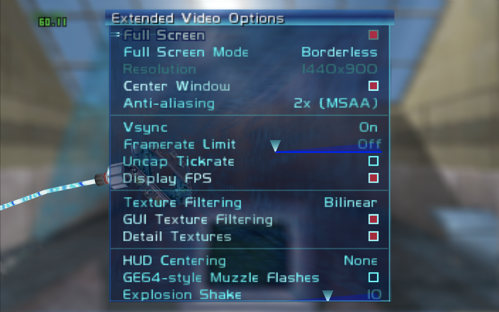

# perfectdark-macvanta

macOS Intel build, bundle, and packaging scripts for the
[fgsfdsfgs/perfect_dark](https://github.com/fgsfdsfgs/perfect_dark) PC port —
targeting **Intel Macs (x86_64) on macOS Tahoe and later**.

Follows the same conventions as
[starship-macalfa](https://github.com/mkoterski/starship-macalfa).

> ⚠️ You need a legally obtained Perfect Dark N64 ROM to use this.  
> The recommended version is **NTSC US v1.1** (`md5: e03b088b6ac9e0080440efed07c1e40f`).

---

## Confirmed Working

**Intel Mac (x86_64)** — MacBook Pro 2020, Intel Core i7, macOS Tahoe 26.3:



---


## Requirements

- Intel Mac (x86_64)
- macOS 10.9 or later (tested on Tahoe 26.x)
- Internet connection (first run only)
- A Perfect Dark ROM (see above)

All other dependencies (Homebrew, cmake, gcc, SDL2.framework) are installed
automatically on first run.

---

## Quick Start

```zsh
git clone https://github.com/mkoterski/perfectdark-macvanta.git
cd perfectdark-macvanta
chmod +x pdmv-*.sh run-pdmv-macos.sh

# 1. Install dependencies (run once)
./pdmv-initial-setup.sh

# 2. Place your ROM, then build
mkdir -p perfect_dark/build-ntsc-final/data
cp /path/to/your/rom.z64 perfect_dark/build-ntsc-final/data/pd.ntsc-final.z64
./pdmv-build-macos.sh

# 3. Run
./run-pdmv-macos.sh
```

---

## Scripts

| Script | Purpose |
|---|---|
| `pdmv-initial-setup.sh` | One-time setup: Xcode CLT, Homebrew, packages, SDL2.framework |
| `pdmv-build-macos.sh` | Clone upstream, configure cmake, compile binary |
| `pdmv-bundle-macos.sh` | Wrap binary as `PerfectDark.app` |
| `pdmv-package-macos.sh` | Create distributable `.dmg` |
| `run-pdmv-macos.sh` | Launch game (config backup, OpenGL, ROM selection) |
| `pdmv-systeminfo.sh` | System snapshot for bug reports |
| `pdmv-collect-crash.sh` | Collect macOS crash reports |

---

## Multiple ROM Regions

Each region requires a separate build. The `--rom` flag selects the region:

```zsh
./pdmv-build-macos.sh --rom pal-final
./run-pdmv-macos.sh   --rom pal-final
```

Supported values: `ntsc-final` (default), `ntsc-1.0`, `pal-final`, `jpn-final`

---

## Versioning

Scripts start at `v0.10` and will reach `v1.0` after confirmed end-to-end
working on a clean Intel Mac running macOS Tahoe.

---

## Credits

- Port: [fgsfdsfgs/perfect_dark](https://github.com/fgsfdsfgs/perfect_dark)
- Decompilation: [n64decomp/perfect_dark](https://github.com/n64decomp/perfect_dark)
- macOS scripts: [mkoterski](https://github.com/mkoterski)
